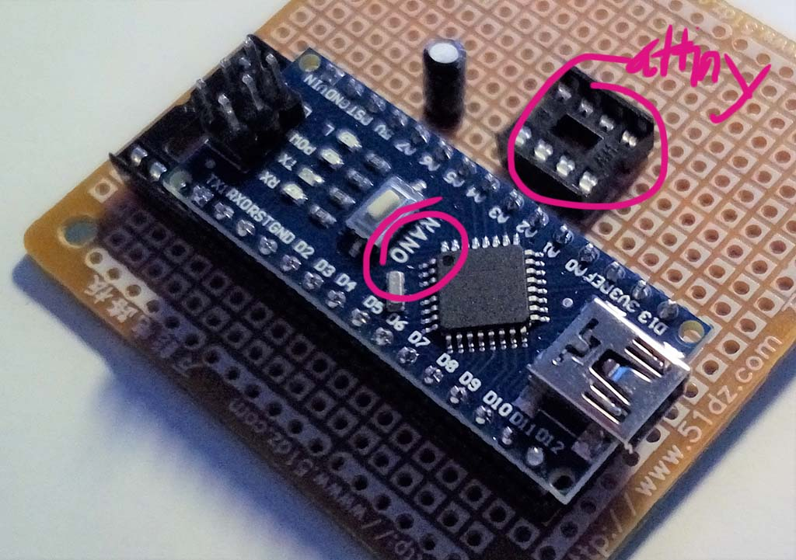
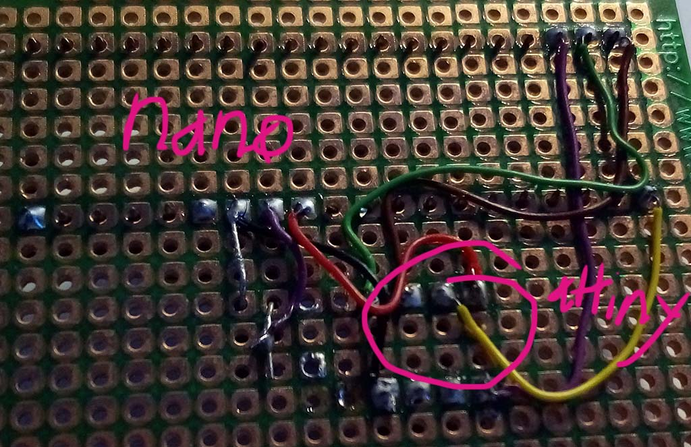
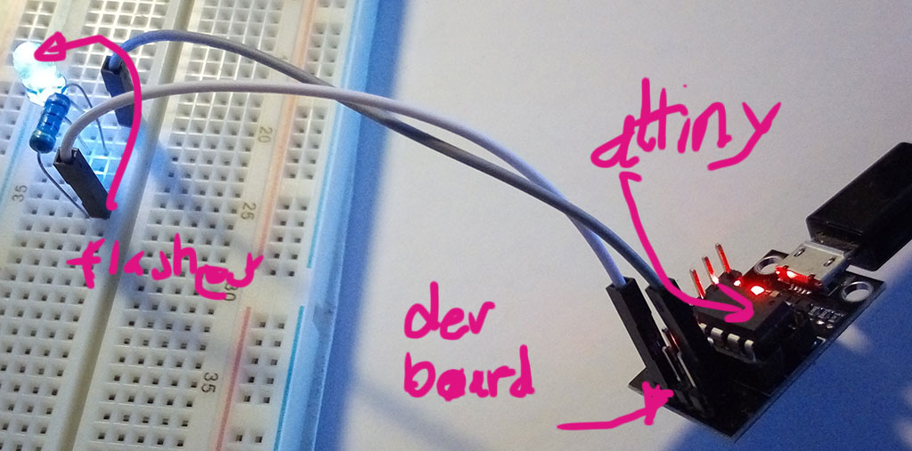
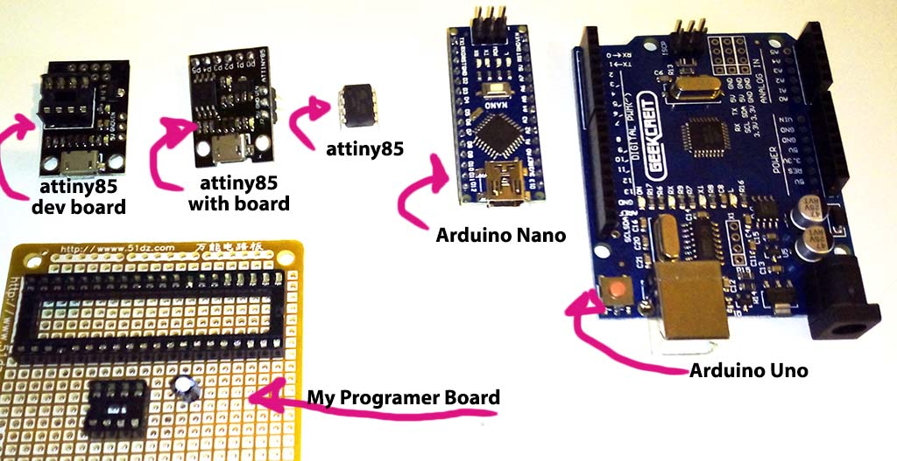
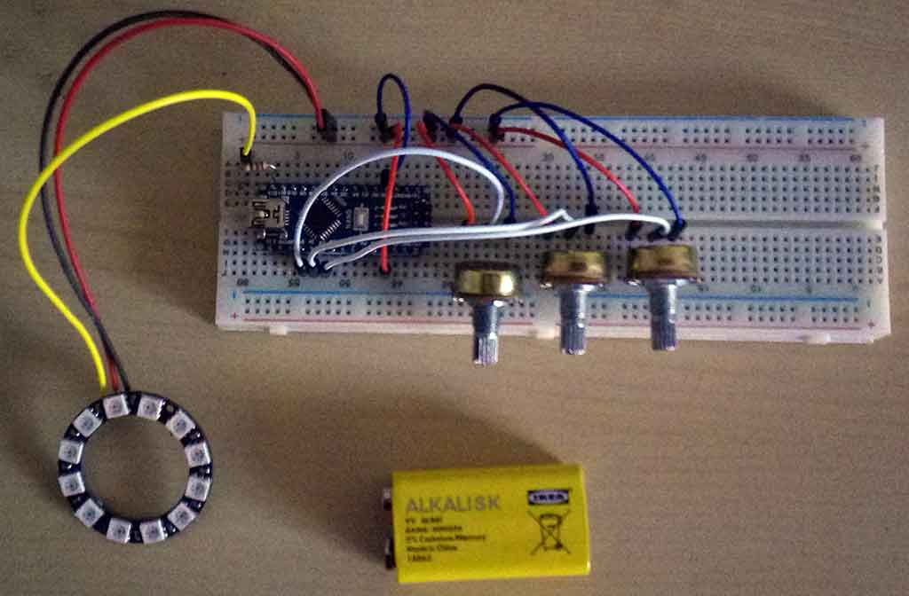

Control RGD LED with Potentiometer
=== 

## Basic Idea
Use one or more potentiometers to control an array of RGD LEDs.

Can be changing color oder color change mode. Can be brightness, can be a lot
of stuff. I'll see as I go.

The idea behind it, is to play with physical things, make something colorful and
get familiar with the technologies. 

### Technologies:
* use PlatformIO
* use attiny85
* use CLion

## My Personal Learning Path
### General
I will not consolidate my conclusions but rather try just to note down, what I did. The hope is, that 
I will not wait documenting it until I understood what I did (what will maybe never happen), but rather
document "on time".

### Phase 1: Initial tooling - Let's start without knowledge 
* use platformio to initialize the project:
  * `platformio init -b attiny85 --ide clion -d lightcontrol`
  * Turn off virus scanner while initializing the project. Scary, but...
* platformio will output he following useful commands:
  * `platformio run` - process/build project from the current directory
  * `platformio run --target upload` or `platformio run -t upload` - upload firmware to embedded board
  * `platformio run --target clean` - clean project (remove compiled files)
  * `platformio run --help` - additional information

* Add some sourcefile to the `src` folder

* Open project in CLion
  * CLion will open the project an greet with build errors
  * This actually comes from definitions in CMakeListPrivate.txt that have two ##.
  * I have no plan, what they do and so forth, but I just "escaped" them by replacing `##` with `\#`
  * Of course I'm keeping the original file, as I have no idea, what this is for and what not
  * After this change, the platform.io commands are available in CLion
  * Update: The issue has been [reported](https://community.platformio.org/t/clion-fails-to-build-project/3126) and fixed in development build.
    * To install it use `platformio upgrade --dev`
    * This produces correct CMakeListsPrivate.txt file (at least the double has issue is fixed)
  
* Build with attiny produced interrupt warnings.
  * Again, no idea, if this is bad or not
  * I will see, as soon as I integrate and upload my project onto the attiny85
  
  
### Phase 1.1: FastLED - I wand to code something
* Install standard FastLED library: `platformio lib install 126`
  * You can search libraries with `platformio lib search ` and the search term
  * For CLion, project needs t be re-inited using `platformio init`
    * BTW: It recreates the CMakeListsPrivate.txt
  * After that, in main.cpp, the FastLED library can be included with `#include <FastLED.h>`  

### Phase 2: Prepare attiny - A lot of TIL. But TIL is good
* The "development boards" I [bought](https://www.banggood.com/Development-Programmer-Board-For-ATtiny85-ATtiny13A-ATtiny25-p-1109741.html?rmmds=search&cur_warehouse=CN)
are not recognized on my machine.
  * After some research I figured out, that the the development board does not include a programmer but only a USB connection
  * To program the attiny, I need a programmer. It is possible, to use an arduino as a programmer for attiny
  * Based in [this](http://woodsgood.ca/projects/2015/02/01/using-a-nano-to-program-an-attiny85/) 
    and [this](http://highlowtech.org/?p=1695) instructions and other research, I soldered a programmer board.
  * Took my again some time to understand that you
    * first: you have to program the Nano as a programmers "the normal way"
    * second: then you can connect the arduino to the programmer-board and use as programmer
    * Of course after everything works, it is super clear, why it has to be like that...
  * I did this with the "normal" arduino IDE as I did not want to fiddle with platformIO. But as I understood, you can define a programmer for platformIO and then programming should work  via platformIO
  * What is no good: To programm attiny I have to put it into the programmer, but to use the attiny, I have to remove it and put it wherever I need.
    This makes no fun and I easily pend the pins and then it is dead.
  * As is understand, the [micronucleus](https://github.com/micronucleus/micronucleus) is a tiny bootloader to enable USB communication. This would make the dev board useful, if I can burn it on the attiny
    (I already killed ony by simply clicking "burn bootloader" in the arduino IDE)
  * This should be my next step in this project  

Programmer Board (front) | Programmer Board (back) | attiny in action | sizes
-------------------------|-------------------------|-------------------|------
 |  |  | 
 
  
### Intermezzo: What Actually Should I Do?
At the beginning I wrote something about learning, tinkering, RGB LED, platformIO,... Thi si al interesting, but what should the project be able to
do in the end? My current plan is to have 3 or 4 potentiometers to control a ring als RGB LEDs. As an initial approach I could control the color via HSL or similar.
This requires 3 potentiometers. And it would be non-animated and static. The 4th potentiometer (or button) could control the type of program to be executed, i.e. what
the other 3 potentiometers actually control. E.g. instead of controlling the S and L value, the second and third potentiometer could control
an animation (e.g. speed / direction). The possibilities are endless (ok, most probably not, but...). 
BTW: FastLED calls the color model [HSV](https://github.com/FastLED/FastLED/wiki/FastLED-HSV-Colors). Or maybe ist is just similar. It will do. 

For the initial implementation I will go with 3 potentiometers and HSL control. Fourth will be added "on demand" as the project grows and succeeds.

At least it looks like attiny offers [5 pins to be used](http://forum.arduino.cc/index.php?topic=87517.0) (without special stuff). one for the RGB LED and 4 to play around.

I mean, I haven't a bootloader, must figure out how to read potentiometer values (and connect them without killing the attiny)
and I have no power supply so far (e.g. battery vs. USB, separate power supply for LED and attiny,...). And a case would be nice as well.

Ok, again: 3 potentiometers and HSL          

### Phase 3: Micronucleus Bootloader - Protect my Pins
In order to be able to use attiny directly without putting in to programmer and in breadboard / dev board and the back into programmer , I will try
to burn the [micronucleus](https://github.com/micronucleus/micronucleus) bootloader onto the attiny. My failed trials while learning, that the dev board has no programmer, indicated, that for windows 10
there are some issues with installing libusb driver, which on the other hand seams to be required for micronucleus. So should be prepared to
spend a lot of time and be disappointed in the end. But that was my impression during phase 2 as well.

So, figure out how to used arduino nano programmer to program attiny to have a bootloader...

* avrdude is the programm to programm AVR like the attiny
* (Most probably) with the installation of the arduino IDE, avrdude is installed
* When you upload the program using arduino, in the preferences you can set verbose output and you see the avrdude commanc.
  This can be the basis for copy & paste the upload command for micronucleus 
* To upload micronucleus, I followed the instructions indicated [here](https://electronics.stackexchange.com/questions/161361/burn-micronucleus-bootloader-to-use-attiny85-via-usb-avrdude)
* The get the hex files, I just cloned the github repo from micronucleus
* The command I executed: `"C:\Program Files (x86)\Arduino\hardware\tools\avr\bin\avrdude.exe" -C"C:\Program Files (x86)\Arduino\hardware\tools\avr/etc/avrdude.conf" -v -v -v -v -carduino -b19200 -PCOM7 -pattiny85 -Uflash:w:"t85_default.hex" -Ulfuse:w:0xe1:m -Uhfuse:w:0xdd:m -Uefuse:w:0xfe:m`
  * be careful about the paths
  * be careful about the COM port
* Of course, the attiny was connected to my programmer board and was programmed through the arduino nano.
* As I had already been playing around with the windows 10 driver installation (see docs from micronucleus), I already had [zadig](http://zadig.akeo.ie/) on my computer.
* Move attiny from the programmer board into the dev board. Tata: Windows 10 recognized the attiny dev board as a "libusb-win32 device" with a "Digispark Bootloader"
* Looks like I finally arrived where I believed i was when busing the dev board. But: I now know more! 

Next will be using CLion to upload the blink program directly to the attiny in the dev board using micronucleus programmer.

* Reality Check:
  * I did quite some research
  * micronucleus is not available through platformIO
  * Bootloader is "destroyed" during upload via Arduino IDE
  * Other possible bootloaders that are used for devices with attiny (e.g. Trinket, Digispark) could not be installed
  * As a consequence, I will for the moment abandon using attiny85 for the development of the project
    * As a side effect: attiny85 would of course not support serial communication and make my life hard developing (e.g. feedback on potentiometer values)
  * I will use an Arduino Nano for development and see (and hope) to use attiny85 in the end

### Phase 4: Power Supply
After switching to Nano, development got easier as installation is way easier. Just adjust platform.ini to the Nano board and you're done. So, the software fun begins.

After digging and some initial coding, it just didn't look right. The LED ring did flicker randomly and it llok like as way more stupid than I
expected to be. I can't event send static values to the ring and it des ot flicker. But it does. After some hours of tinkering and experimenting, I realized:
The power supply to the LEDs is unstable. My design foresees the LED power directly and only having the data pin from the Nano (or the attiny). To
convert from 9V block battery to 5V for LED I used a (simple) step down element. It showed, that the power spply was not steady enought so the LED would en get
the signal properly and hence flicker.

Arduna Non can output vo 0.5 ampères. 12 RGB LED would be too much (if you googled properly), but as rarely, all 3 rolors of the LED wil be on and on
full power, Adafruit (or Sparkfun) uses as a rough estimate only one third.

So, for development purposes, I connected the LED power supply (and the data connection) to the Nano. And ir worked.

In the mean time, I had already googled some examples on how to make fancy things with the LED ring.

So, here I am with some working installation consisting of software and hardware:

  
## Resources

* [Programmable RGB Mood Light - Attiny85](http://www.instructables.com/id/Programmable-RGB-Mood-Light-Attiny85/) - Inspiration on wiring
* [PlatformIO](http://platformio.org/) - The tooling for using 
* [PlatformIO CLion integration](http://docs.platformio.org/en/latest/ide/clion.html)
* [PlatformIO attiny boards](http://docs.platformio.org/en/latest/platforms/atmelavr.html#generic-attiny)
* [Jetbrains CLion](https://www.jetbrains.com/clion/) -  The IDE I'm using
* [Fastled Animation Library](http://fastled.io/) - Used for controlling WS2812B and other RGB LEDs
* [Arduino Stack Exchange, Clion + arduino](https://arduino.stackexchange.com/a/20296) - Some additional workflow hints
* [Another CLion attiny FastLED Project from me](https://github.com/fade2g/attiny85_platformio_fastled)  